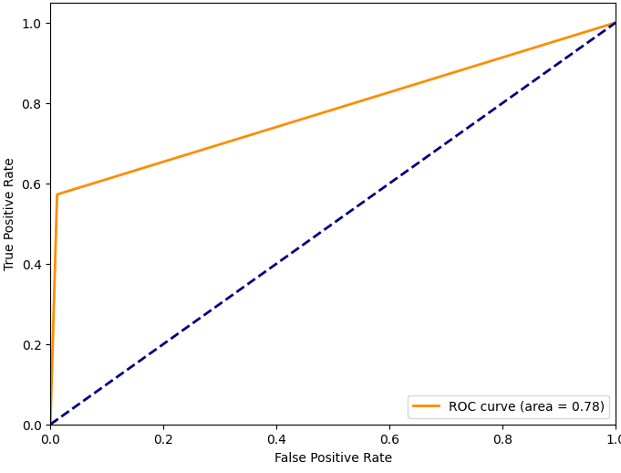
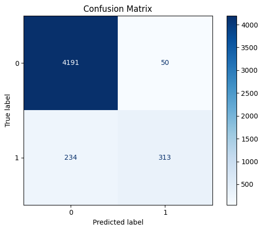
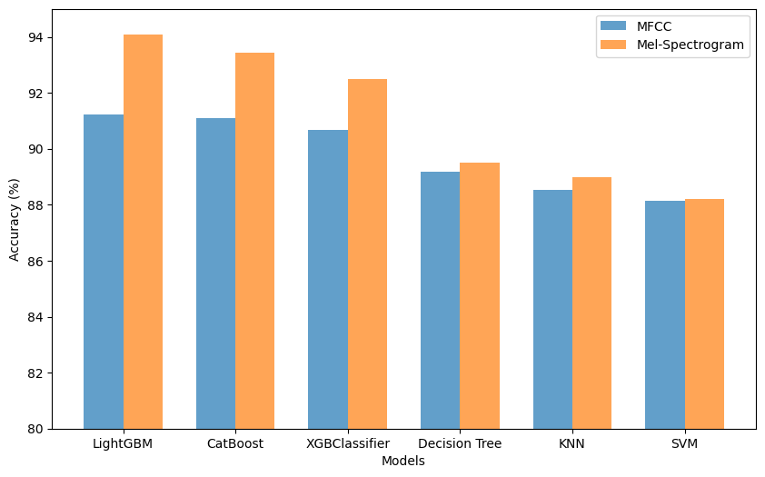

# Neonatal Seizure Detection
This repository contains code for the implementation of the paper titled **Neonatal Seizure Detection using Gradient-Based Approach with LightGBM Model and Optuna Optimization**.

### Abstract
Seizures pose a critical threat to the neurological well-being of newborns, particularly those in neonatal intensive care units (NICUs). Detecting neonatal seizures is challenging due to their subtle and often complex clinical presentation, making them difficult to identify through standard clinical examinations. Electroencephalography (EEG) plays a pivotal role in diagnosing neonatal seizures by providing a non-invasive method for tracking abnormal brain signals. However, the complexity of EEG interpretation necessitates advanced technological integration. This research incorporates a gradient-based approach, utilizing the LightGBM machine learning (ML) model to enhance the predictability of neonatal seizures. By optimizing hyperparameters through Optuna, our approach achieves a breakthrough accuracy of 94.07% and an 86.23% precision score, considerably lowering false positives and minimizing unnecessary NICU interventions. The system's performance is evaluated across various metrics and window lengths, demonstrating its versatility and reliability in improving patient care and diagnostic precision in NICUs.

### Introduction
Neonatal seizures represent a significant challenge in neonatal intensive care units (NICUs) due to their often subtle and complex presentation. Electroencephalography (EEG) is a crucial tool in identifying these seizures; however, the interpretation of EEG data is complex and requires sophisticated analytical techniques. This research aims to enhance the detection of neonatal seizures by leveraging machine learning, specifically the LightGBM model, to analyze EEG recordings and improve diagnostic accuracy.

### Methodology
Our approach involves the following steps:
1. **Data Collection:** Utilizing standard EEG datasets recorded from newborns in NICUs, available at [Dataset](https://zenodo.org/records/2547147)
2. **Preprocessing:** Filtering and normalizing EEG data for optimal input into the LightGBM model.
3. **Feature Extraction:** Using mel spectrograms to extract relevant features from EEG signals. The mel spectrogram provides a time-frequency representation, capturing subtle changes in the brain’s electrical activity that are critical for accurate seizure detection. 

    
  &nbsp; &nbsp; &nbsp; &nbsp;
    
  

4. **Model Development:** Implementing the LightGBM model, a gradient-based ML algorithm, to detect seizure patterns.
5. **Hyperparameter Optimization:** Using Optuna to fine-tune the model’s hyperparameters, enhancing accuracy and reducing false positives.
6. **Evaluation:** Assessing the model’s performance across various window lengths using metrics such as accuracy, precision, recall, and F1-score.

### Results
Our LightGBM model achieved
* **Accuracy:** 94.07%
* **Precision:** 86.23%
* **ROC-AUC:** 78.02%

  
&nbsp; &nbsp; &nbsp; &nbsp;
  

These metrics indicate the model's high reliability in detecting neonatal seizures, significantly reducing false positives and minimizing unnecessary interventions in NICUs.

### Conclusion
This research demonstrates the potential of machine learning, particularly the LightGBM model, to enhance the detection of neonatal seizures in NICUs. Our approach not only improves diagnostic accuracy but also offers a robust tool for clinicians, ultimately contributing to better patient outcomes and more efficient NICU practices.

### License
This project is licensed under the MIT License - see the LICENSE file for details.
