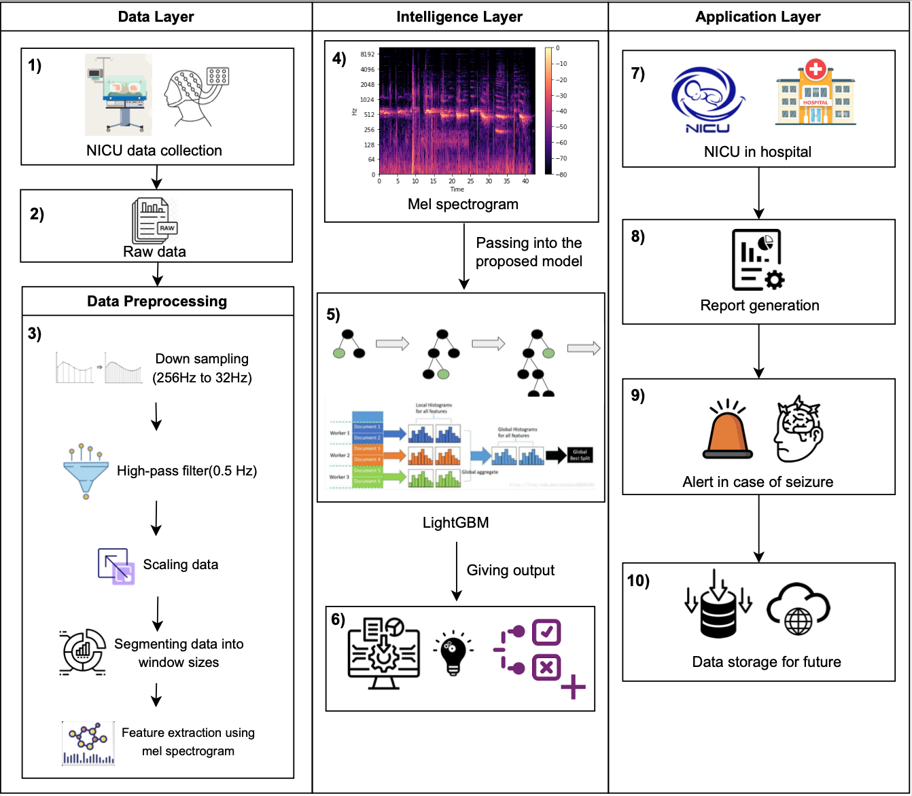

# Neonatal Seizure Detection

This repository contains code for the implementation Neonatal Seizure Detection using LightGBM Model and Optuna Optimization.

### Introduction

This research aims to enhance the detection of neonatal seizures by leveraging machine learning, specifically the LightGBM model, to analyze EEG recordings and improve diagnostic accuracy.

Below is our Proposed Architecture

### Methodology

Our approach involves the following steps:

1. **Data Collection:** Utilizing standard EEG dataset recorded from newborns in NICUs, available at [Dataset](https://zenodo.org/records/2547147)

2. **Preprocessing:** Filtering and normalizing EEG data.

3. **Feature Extraction:** Using mel spectrograms to extract relevant features from EEG signals. The mel spectrogram provides a time-frequency representation, capturing subtle changes in the brain’s electrical activity that are critical for accurate seizure detection. 

    

  &nbsp; &nbsp; &nbsp; &nbsp;

    

  

4. **Model:** Implementing the LightGBM model, a gradient-based ML algorithm, to detect seizure patterns.

5. **Hyperparameter Optimization:** Using Optuna to fine-tune the model’s hyperparameters, enhancing accuracy and reducing false positives.

6. **Evaluation:** Assessing the model’s performance across various window lengths using metrics such as accuracy, precision, recall, and F1-score.

### Results

Our LightGBM model achieved

* **Accuracy:** 94.07%

* **Precision:** 86.23%

* **ROC-AUC:** 78.02%

  

&nbsp; &nbsp; &nbsp; &nbsp;

  

### Conclusion

This research demonstrates the potential of machine learning to enhance the detection of neonatal seizures in NICUs. Our approach not only improves diagnostic accuracy but also offers a robust tool for clinicians, ultimately contributing to better patient outcomes and more efficient NICU practices.

### License

This project is licensed under the MIT License - see the LICENSE file for details.
